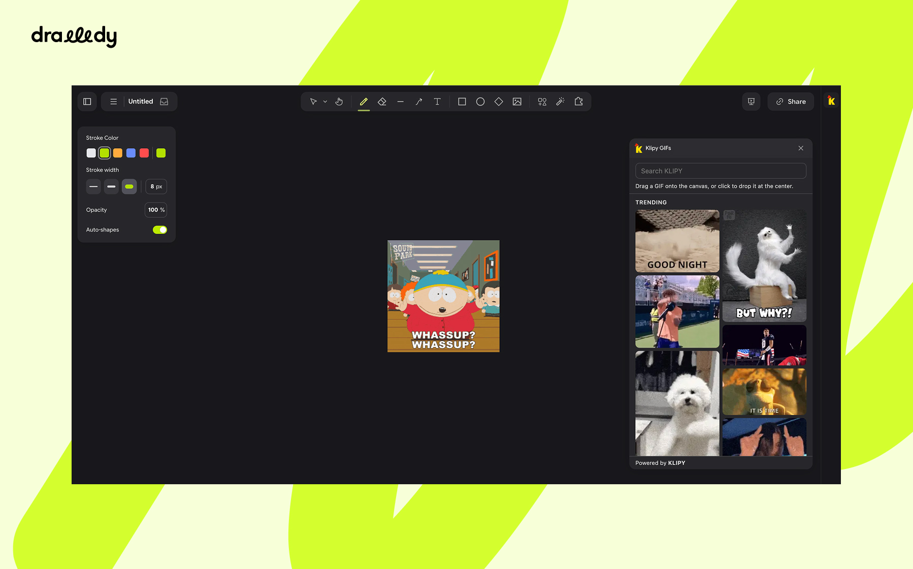

# Klipy GIFs — Drawdy extension

Search [KLIPY](https://klipy.com)'s GIF library from the extension rail and put GIFs straight on the board.

Install the extension, click the icon, drag a GIF onto the canvas.

## How to use

1. **Open the palette.** Click the yellow KLIPY rooster icon in the extension rail on the left. The palette slides out with trending GIFs already loaded.
2. **Find a GIF.** Type in the **Search KLIPY** box at the top — results refresh on their own a moment after you stop typing. Scroll to the bottom of the list to load more.
3. **Put it on the board.** Drag a GIF out of the palette and let go over the canvas to drop it there, or just click a GIF to drop it in the middle of your current view.

| Interaction                              | What happens                                 |
| ---------------------------------------- | -------------------------------------------- |
| Click the rail icon                      | Opens (or reopens) the GIF palette           |
| Palette with an empty search box         | Shows **Trending** GIFs                      |
| Type in the search box                   | Searches KLIPY shortly after you stop typing |
| `Esc` in the search box                  | Clears the search and goes back to trending  |
| Scroll to the bottom of the list         | Loads the next batch of GIFs                 |
| Drag a GIF onto the canvas               | Places it where you release the pointer      |
| Drag a GIF and let go inside the palette | Nothing — the drop is cancelled              |
| Click a GIF                              | Places it at the center of the current view  |

---

## Credits

GIFs and search are powered by [KLIPY](https://klipy.com).
