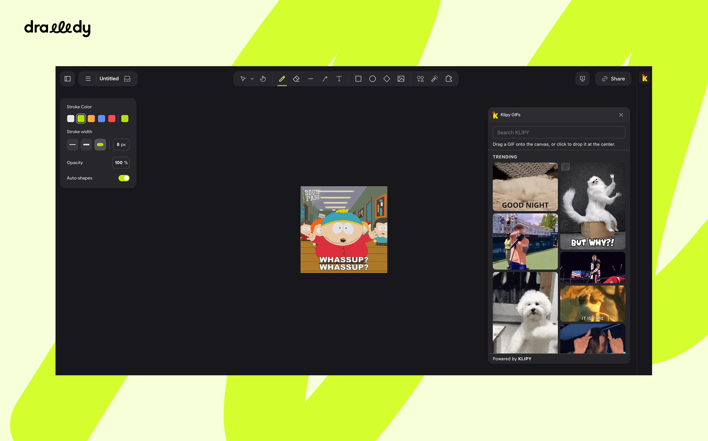

# Klipy — Drawdy extension

Search [KLIPY](https://klipy.com)'s GIFs, stickers and clips from the extension rail and put them straight on the board.

Install the extension, click the icon, pick a tab, drag something onto the canvas.

## How to use

1. **Open the palette.** Click the yellow KLIPY rooster icon in the extension rail on the left. The palette slides out with trending GIFs already loaded.
2. **Pick a media type.** Switch between **GIFs**, **Stickers** and **Clips** with the tabs under the search box. Your search text carries over between tabs.
3. **Find something.** Type in the search box at the top — results refresh on their own a moment after you stop typing. Scroll to the bottom of the list to load more.
4. **Put it on the board.** Drag an item out of the palette and let go over the canvas to drop it there, or just click it to drop it in the middle of your current view.

| Interaction                                | What happens                                        |
| ------------------------------------------ | --------------------------------------------------- |
| Click the rail icon                        | Opens (or reopens) the palette                      |
| Click a tab (GIFs / Stickers / Clips)      | Switches media type, keeping the current search     |
| `←` / `→` with a tab focused               | Moves to the neighbouring tab                       |
| Palette with an empty search box           | Shows **Trending** items for the active tab         |
| Type in the search box                     | Searches KLIPY shortly after you stop typing        |
| `Esc` in the search box                    | Clears the search and goes back to trending         |
| Scroll to the bottom of the list           | Loads the next batch                                |
| Drag an item onto the canvas               | Places it where you release the pointer             |
| Drag an item and let go inside the palette | Nothing — the drop is cancelled                     |
| Click an item                              | Places it at the center of the current view         |

Stickers are placed with their transparency intact. Clips are placed as animated images (the GIF rendition), so they loop silently on the board.

---

## Credits

GIFs, stickers, clips and search are powered by [KLIPY](https://klipy.com).
